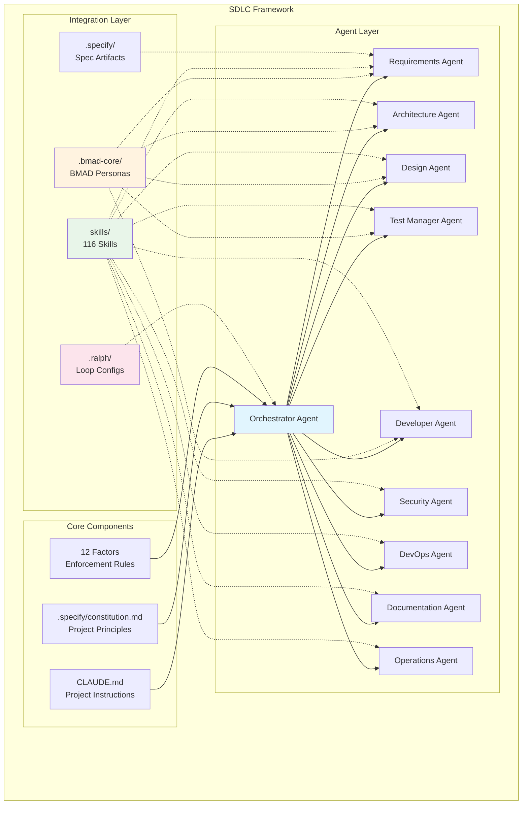
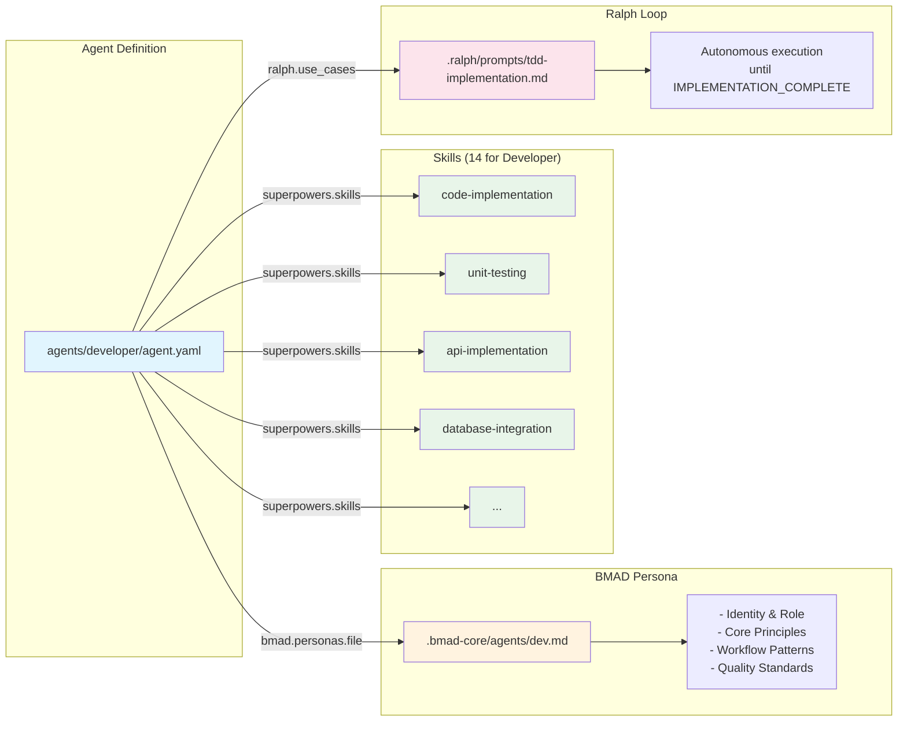
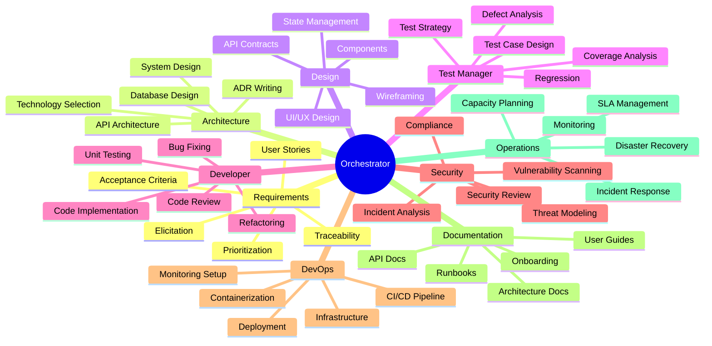

# SDLC Framework Guide

## Overview

This project uses a **10-agent SDLC framework** integrating multiple methodologies:
- **GitHub Spec Kit** - Spec-driven development
- **BMAD Method** - Agent personas and workflows
- **Obra Superpowers** - 116 engineering skills
- **Ralph Wiggum** - Autonomous execution loops
- **12 Factors** - Agentic SDLC principles

---

## Architecture Diagram



---

## Setup Workflow (12 Phases)

```mermaid
flowchart LR
    subgraph "Foundation"
        P1[Phase 1<br/>Foundation]
        P2[Phase 2<br/>Spec Kit]
        P3[Phase 3<br/>Superpowers]
    end

    subgraph "Frameworks"
        P4[Phase 4<br/>BMAD Install]
        P5[Phase 5<br/>Ralph Config]
        P6[Phase 6<br/>12 Factors]
    end

    subgraph "Agents"
        P7[Phase 7<br/>Wire Agents]
        P8[Phase 8<br/>Populate Skills]
        P9[Phase 9<br/>Orchestrator]
    end

    subgraph "Finalize"
        P10[Phase 10<br/>Verification]
        P11[Phase 11<br/>Production]
        P12[Phase 12<br/>Plugins]
    end

    P1 --> P2 --> P3 --> P4 --> P5 --> P6
    P6 --> P7 --> P8 --> P9 --> P10 --> P11 --> P12

    style P4 fill:#fff3e0
    style P7 fill:#e8f5e9
    style P8 fill:#e8f5e9
    style P12 fill:#fce4ec
```



---

## Agent Workflow

```mermaid
flowchart TD
    START((Start)) --> SPEC["/specify<br/>Capture Requirements"]

    SPEC --> REQ_AGENT[Requirements Agent<br/>+ analyst.md persona<br/>+ 10 REQ skills]
    REQ_AGENT --> GATE1{Gate:<br/>Requirements<br/>Complete?}

    GATE1 -->|No| REQ_AGENT
    GATE1 -->|Yes| PLAN["/plan<br/>Create Architecture"]

    PLAN --> ARCH_AGENT[Architecture Agent<br/>+ architect.md persona<br/>+ 12 ARCH skills]
    ARCH_AGENT --> GATE2{Gate:<br/>Architecture<br/>Approved?}

    GATE2 -->|No| ARCH_AGENT
    GATE2 -->|Yes| DESIGN[Design Phase]

    DESIGN --> DES_AGENT[Design Agent<br/>+ ux-expert.md persona<br/>+ 10 DES skills]
    DES_AGENT --> GATE3{Gate:<br/>Design<br/>Validated?}

    GATE3 -->|No| DES_AGENT
    GATE3 -->|Yes| IMPL["/implement<br/>Build Features"]

    IMPL --> DEV_AGENT[Developer Agent<br/>+ dev.md persona<br/>+ 14 DEV skills]
    DEV_AGENT --> TEST_AGENT[Test Manager Agent<br/>+ qa.md persona<br/>+ 13 TEST skills]

    TEST_AGENT --> GATE4{Gate:<br/>Tests<br/>Passing?}

    GATE4 -->|No| DEV_AGENT
    GATE4 -->|Yes| SECURITY[Security Review]

    SECURITY --> SEC_AGENT[Security Agent<br/>+ dev.md persona<br/>+ 13 SEC skills]
    SEC_AGENT --> GATE5{Gate:<br/>Security<br/>Clean?}

    GATE5 -->|No| DEV_AGENT
    GATE5 -->|Yes| DEPLOY["/deploy<br/>Release"]

    DEPLOY --> OPS_AGENT[DevOps Agent<br/>+ dev.md persona<br/>+ 14 OPS skills]
    OPS_AGENT --> DONE((Complete))

    style REQ_AGENT fill:#e3f2fd
    style ARCH_AGENT fill:#e3f2fd
    style DES_AGENT fill:#e3f2fd
    style DEV_AGENT fill:#e3f2fd
    style TEST_AGENT fill:#e3f2fd
    style SEC_AGENT fill:#e3f2fd
    style OPS_AGENT fill:#e3f2fd
```



---

## Skills & BMAD Integration



---

## Agent Responsibilities



---

## Directory Structure

```
studyabroad-v2/
├── CLAUDE.md                    # Project instructions for Claude
├── .specify/                    # Spec Kit artifacts
│   ├── constitution.md          # Project principles
│   └── templates/               # Requirement templates
├── .bmad/                       # BMAD configuration
│   └── config.yaml              # Integration settings
├── .bmad-core/                  # BMAD installation
│   ├── agents/                  # Persona definitions
│   │   ├── analyst.md
│   │   ├── architect.md
│   │   ├── dev.md
│   │   ├── qa.md
│   │   └── ...
│   ├── templates/               # BMAD templates
│   ├── workflows/               # BMAD workflows
│   └── checklists/              # Quality checklists
├── .ralph/                      # Ralph Wiggum config
│   ├── config.yaml              # Loop settings
│   └── prompts/                 # Loop prompts
├── agents/                      # 10 Agent definitions
│   ├── orchestrator/
│   │   └── agent.yaml           # Skills + BMAD personas
│   ├── requirements/
│   ├── architecture/
│   ├── design/
│   ├── test-manager/
│   ├── developer/
│   ├── security/
│   ├── devops/
│   ├── documentation/
│   └── operations/
├── skills/                      # 116 Skill templates
│   ├── orchestration/           # 8 skills
│   ├── requirements/            # 10 skills
│   ├── architecture/            # 12 skills
│   ├── design/                  # 10 skills
│   ├── testing/                 # 13 skills
│   ├── development/             # 14 skills
│   ├── security/                # 13 skills
│   ├── devops/                  # 14 skills
│   ├── documentation/           # 10 skills
│   └── operations/              # 12 skills
├── config/                      # Configuration files
│   ├── spec-kit/
│   ├── bmad/
│   ├── ralph/
│   ├── superpowers/
│   └── 12-factors/
├── docs/                        # Documentation
├── src/                         # Source code
└── tests/                       # Test suites
```

---

## Usage Instructions

### Initial Setup

```bash
# Run the setup script (12 phases)
./setup-sdlc-framework.sh

# Or start from a specific phase
./setup-sdlc-framework.sh --phase 4

# Dry run to see what would happen
./setup-sdlc-framework.sh --dry-run

# Verify setup
./scripts/verify-setup.sh
```

### Daily Workflow Commands

| Command | Description | Agent |
|---------|-------------|-------|
| `/orchestrate` | Start task coordination | Orchestrator |
| `/orchestrate status` | Check workflow state | Orchestrator |
| `/specify` | Capture requirements | Requirements |
| `/plan` | Create architecture | Architecture |
| `/implement` | Build features | Developer |
| `/test` | Run test validation | Test Manager |
| `/deploy` | Execute deployment | DevOps |

### Autonomous Execution (Ralph Wiggum)

```bash
# Start an autonomous loop
/ralph-loop "Implement user authentication with TDD" \
  --max-iterations 50 \
  --completion-promise "IMPLEMENTATION_COMPLETE"

# Cancel a running loop
/cancel-ralph
```

### Gate Validation

The orchestrator enforces gates between phases:

| Gate | Required Artifacts | Approver |
|------|-------------------|----------|
| Requirements | spec.md, acceptance criteria | Human |
| Architecture | architecture.md, ADRs | Human |
| Implementation | passing tests, coverage | Developer |
| Security | clean scan, compliance | Security |
| Deployment | pipeline green, staging OK | DevOps |

### Working with Agents

Each agent has:
1. **BMAD Persona** - Behavioral guidelines from `.bmad-core/agents/`
2. **Skills** - Executable procedures from `skills/`
3. **Ralph Config** - Autonomous loop settings

Example agent invocation:
```
As the Developer Agent:
- Load persona from .bmad-core/agents/dev.md
- Apply skills: development/code-implementation, development/unit-testing
- Follow TDD process until tests pass
- Output: IMPLEMENTATION_COMPLETE when done
```

### Cross-Cutting Collaborations

Some skills require multiple agents:

| Skill | Owner | Collaborators | Reason |
|-------|-------|---------------|--------|
| code-review | Developer | Security, Architecture | Compliance reviews |
| change-impact | Requirements | Test Manager, Developer | Affects planning |
| adr-writing | Architecture | Developer, Security | Implementation decisions |
| api-documentation | Documentation | Developer, Design | API spec changes |

---

## 12 Factors Enforcement

The framework enforces these principles:

1. **Strategic Mindset** - No code without spec
2. **Context Scaffolding** - Constitution and guardrails loaded
3. **Mission Definition** - Structured specification process
4. **Structured Planning** - Multi-step refinement
5. **Dual Execution** - Sync (human-in-loop) and Async (autonomous)
6. **The Great Filter** - Quality gates at phase boundaries
7. **Adaptive Quality** - Flexible QA based on risk
8. **AI-Augmented Testing** - Risk-based test generation
9. **Traceability** - Requirements linked to code
10. **Continuous Feedback** - Production informs specs
11. **Security by Design** - Built-in security practices
12. **Team Capability** - Knowledge sharing

---

## Quick Reference

### File Locations

| What | Where |
|------|-------|
| Project instructions | `CLAUDE.md` |
| Project principles | `.specify/constitution.md` |
| BMAD personas | `.bmad-core/agents/*.md` |
| Agent definitions | `agents/*/agent.yaml` |
| Skills | `skills/**/SKILL.md` |
| Ralph prompts | `.ralph/prompts/*.md` |
| Workflow state | `.sdlc/workflow-state.json` |

### Key Commands

```bash
# Verify setup
./scripts/verify-setup.sh

# Check BMAD status
npx bmad-method status

# List available skills
find skills -name "SKILL.md" | wc -l

# View agent configuration
cat agents/developer/agent.yaml
```
